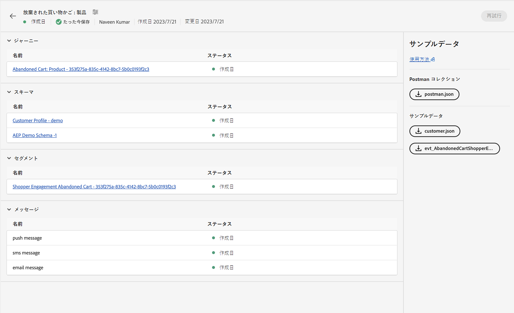
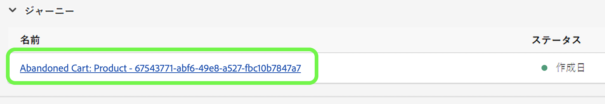
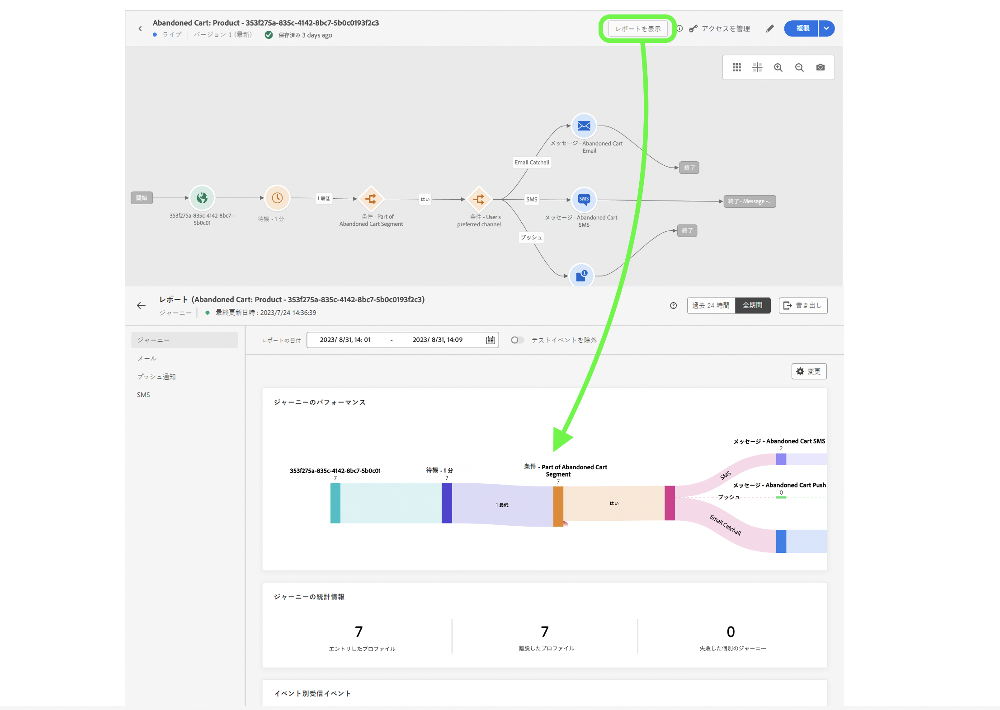

# 単一イベント

## 従うべき手順 {#steps-to-follow}

>[!CONTEXTUALHELP]
>id="marketerexp_sampledata_unitaryevent"
>title="使用方法"
>abstract="詳しくは、リンクを参照してください"

>[!IMPORTANT]
>
>以下の手順は&#x200B;**[!UICONTROL プレイブック]**&#x200B;ごとに異なる場合があるので、常に各&#x200B;**[!UICONTROL プレイブック]**&#x200B;のサンプルデータセクションを参照してください。

## 前提条件

* Postman ソフトウェアをインストールする必要があります
* プレイブックを使用して、**[!UICONTROL ジャーニー]**、**[!UICONTROL スキーマ]**、**[!UICONTROL セグメント]**、**[!UICONTROL メッセージ]**&#x200B;などのインスタンスアセットを作成します。

作成したアセットは、`Bill Of Material` ページに表示されます



## 必要なコレクションを含む Postman の準備

1. **[!UICONTROL ユースケースプレイブック]**&#x200B;アプリケーションにアクセスします。
1. 各&#x200B;**[!UICONTROL プレイブック]**&#x200B;カードをクリックして、**[!UICONTROL プレイブック]**&#x200B;の詳細ページにアクセスします。
1. **[!UICONTROL 部品表]**&#x200B;ページにアクセスし、「**[!UICONTROL サンプルデータ]**」セクションを見つけます。
1. UI 上の各ボタンをクリックして `postman.json` をダウンロードします。
1. **[!DNL Postman Software]** に `postman.json` を読み込みます。
1. この検証用に専用の Postman 環境（`Adobe <PLAYBOOK_NAME>` など）を作成します。

## IMS トークンの取得

>[!NOTE]
>
>すべての環境変数では大文字と小文字が区別されるので、常に正確な変数名を使用してください。

1. [Experience Platform API の認証とアクセス](https://experienceleague.adobe.com/docs/experience-platform/landing/platform-apis/api-authentication.html?lang=ja)ドキュメントに従ってアクセストークンを生成してください。
1. アクセストークンの値を `ACCESS_TOKEN` という名前の環境変数に保存します。
1. `API_KEY`、`IMS_ORG`、`SANDBOX_NAME` などの他の認証関連の値を環境変数に保存します。

>[!IMPORTANT]
>
>Postman から API を実行する前に、必要な環境変数がすべて追加されていることを確認します。

## プレイブックで作成したジャーニーの公開

ジャーニーを公開するには 2 つの方法があります。いずれかを選択できます。

1. **AJO UIの使用** - `Bill Of Material Page` のジャーニーリンクをクリックします。これにより、ジャーニーページにリダイレクトされ、そこで「**[!UICONTROL 公開]**」ボタンをクリックすると、ジャーニーが公開されます。

   

1. **Postman API の使用**

   1. **[!DNL Journey Publish]**／**[!DNL Queue journey publish job]** から **[!DNL Publish Journey]** リクエストをトリガーします。
   1. ジャーニーの公開には時間がかかる場合があるので、ステータスを確認するには、`response.status` が `SUCCESS` になるまで、ジャーニー公開ステータスの確認 API を実行します。ジャーニーの公開に時間がかかる場合は、10～15 秒待機する必要があります。

   >[!NOTE]
   >
   >すべての環境変数では大文字と小文字が区別されるので、常に正確な変数名を使用してください。

## 顧客プロファイルを取得

>[!TIP]
>
>メールに `+<variable>` を追加することで、同じメールアドレスを再利用できます。例えば、`usertest@email.com` は、`usertest+v1@email.com` または `usertest+24jul@email.com` として再利用できます。これは、同じメール ID を使用しながら、毎回新しいプロファイルを作成するのに役立ちます。

1. 初めてのユーザーは、**[!DNL customer dataset]** と **[!DNL HTTP Streaming Inlet Connection]** を作成する必要があります。
1. 既に **[!DNL customer dataset]** と **[!DNL HTTP Streaming Inlet Connection]** を作成している場合は、手順 `5` に進んでください。
1. **[!DNL Customer Profile Ingestion]**／**[!DNL Create Customer Profile InletId]**／**[!DNL Create Dataset]** をトリガーして **[!DNL customer dataset]** を作成します。これにより、`CustomerProfile_dataset_id` が Postman 環境変数に保存されます。
1. **[!DNL HTTP Streaming Inlet Connection]** を作成し、**[!DNL Customer Profile Ingestion > Create Customer Profile InletId]** で Postman API を使用します。

   1. `CustomerProfile_dataset_id` は、Postman 環境変数で使用できる必要があります。使用できない場合は、手順 `3` を参照してください。
   1. **[!DNL `CREATE Base Connection`]** から [!DNL create base connection] までをトリガーします。
   1. **[!DNL `CREATE Source Connection`]** から [!DNL create source connection] までをトリガーします。
   1. **[!DNL `CREATE Target Connection`]** から [!DNL create target connection] までをトリガーします。
   1. **[!DNL `CREATE Dataflow`]** から [!DNL create dataflow] までをトリガーします。
   1. **[!DNL `GET Base Connection`]** をトリガー - これにより、`CustomerProfile_inlet_id` が Postman 環境変数に自動的に保存されます。

1. この手順では、Postman 環境変数に `CustomerProfile_dataset_id` と `CustomerProfile_inlet_id` を設定する必要があります。設定しない場合は、手順 `3` または `4` をそれぞれ参照してください。
1. 顧客を取得するには、ユーザーは `customer_country_code`、`customer_mobile_no`、`customer_first_name`、`customer_last_name` および `email` を Postman 環境変数に保存する必要があります。

   1. `customer_country_code` は、携帯電話番号の国コード（`91` または `1` など）になります
   1. `customer_mobile_no` は、携帯電話番号（`9987654321` など）になります
   1. `customer_first_name` は、ユーザーの名になります
   1. `customer_last_name` は、ユーザーの姓になります
   1. `email` は、ユーザーのメールアドレスになります。これは、新しいプロファイルを取得できるように個別のメール ID を使用するために重要です。

1. Postman リクエストを **[!DNL Customer Ingestion]**／**[!DNL Customer Streaming Ingestion]** で更新して、顧客の優先チャネルを変更します。デフォルトでは、[!DNL `email`] はリクエストで設定されます。

   ```js
   "consents": {
       "marketing": {
           "preferred": "email",
           "email": {
               "val": "y"
           },
           "push": {
               "val": "n"
           },
           "sms": {
               "val": "n"
           }
       }
   }
   ```

1. 優先チャネルを `sms` または `push` に変更し、各チャネルの値を `y` に、`n` を次のような他の値にします。

   ```js
   "consents": {
       "marketing": {
           "preferred": "sms",
           "email": {
               "val": "n"
           },
           "push": {
               "val": "n"
           },
           "sms": {
               "val": "y"
           }
       }
   }
   ```

1. 最後に、**[!DNL `Customer Profile Ingestion > Customer Profile Streaming Ingestion`]** をトリガーして、顧客プロファイルを取得します。

## イベントの取得

1. 初めてのユーザーは、**[!DNL event dataset]** と **[!DNL HTTP Streaming Inlet Connection for events]** を作成する必要があります
1. 既に **[!DNL event dataset]** と **[!DNL HTTP Streaming Inlet Connection for events]** を作成している場合は、手順 `5` に進んでください。
1. **[!DNL `Schemas Data Ingestion > AEP Demo Schema Ingestion > Create AEP Demo Schema InletId > Create Dataset`]** をトリガーして **[!DNL event dataset]** を作成します。これにより、Postman 環境変数に `AEPDemoSchema_dataset_id` が保存されます
1. **[!DNL HTTP Streaming Inlet Connection for events]** を作成し、**[!DNL Schemas Data Ingestion]**／**[!DNL AEP Demo Schema Ingestion]**／**[!DNL Create AEP Demo Schema InletId]** で Postman API を使用します。

   1. `AEPDemoSchema_dataset_id` は、Postman 環境変数で使用できる必要があります。使用できない場合は、手順 `3` を参照してください
   1. **[!DNL `CREATE Base Connection`]** から [!DNL create base connection] までをトリガーします
   1. **[!DNL `CREATE Source Connection`]** から [!DNL create source connection] までをトリガーします
   1. **[!DNL `CREATE Target Connection`]** から [!DNL create target connection] までをトリガーします
   1. **[!DNL `CREATE Dataflow`]** から [!DNL create dataflow] までをトリガーします
   1. **[!DNL `GET Base Connection`]** をトリガー - これにより、`AEPDemoSchema_inlet_id` が Postman 環境変数に自動的に保存されます

1. この手順では、Postman 環境変数に `AEPDemoSchema_dataset_id` と `AEPDemoSchema_inlet_id` を設定する必要があります。設定しない場合は、手順 `3` または `4` をそれぞれ参照してください
1. イベントを取得するには、ユーザーは Postman の **[!DNL Schemas Data Ingestion]**／**[!DNL AEP Demo Schema Ingestion]**／**[!DNL AEP Demo Schema Streaming Ingestion]** のリクエスト本文の時間変数 `timestamp` を変更する必要があります。

   1. `timestamp` では、イベントの発生時刻に現在のタイムスタンプを使用します。 例えば、`2023-07-21T16:37:52+05:30` では必要に応じてタイムゾーンを調整します。

1. **[!DNL Schemas Data Ingestion > AEP Demo Schema Ingestion > AEP Demo Schema Streaming Ingestion]** をトリガーしてイベントを取得し、ジャーニーをトリガーできるようにします

## 最終検証

**[!DNL Ingest the Customer Profile]** の手順 `8` で使用する選択した優先チャネルでメッセージを受信する必要があります

* `customer_country_code` と `customer_mobile_no` で優先チャネルが `sms` の場合は、`SMS`
* `email` で優先チャネルが `email` の場合は、`Email`

または、`Journey Report` をオンにすることもできます。オンにするには、`Bill of Materials page` で `Journey Object` をクリックします。これにより、`Journey Details page` にリダイレクトされます。

公開されたジャーニーについては、ユーザーは「**[!UICONTROL レポートを表示]**」ボタンを取得する必要があります



## クリーンアップ

`Journey` の複数のインスタンスを同時に実行しないでください。検証のみを目的とする場合は、検証が完了したらジャーニーを停止してください。
