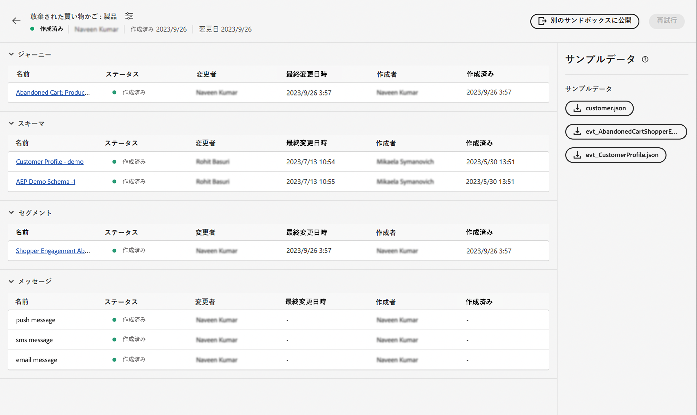

# 単一イベント

## 従うべき手順 {#steps-to-follow}

>[!CONTEXTUALHELP]
>id="marketerexp_sampledata_unitaryevent"
>title="使用方法"
>abstract="詳しくは、リンクを参照してください"

>[!IMPORTANT]
>
>以下の手順は&#x200B;**[!UICONTROL プレイブック]**&#x200B;ごとに異なる場合があるので、常に各&#x200B;**[!UICONTROL プレイブック]**&#x200B;のサンプルデータセクションを参照してください。

## 前提条件

* プレイブックを使用して、**[!UICONTROL ジャーニー]**、**[!UICONTROL スキーマ]**、**[!UICONTROL セグメント]**、**[!UICONTROL メッセージ]**&#x200B;などのインスタンスアセットを作成します。

* 作成したアセットは、`Bill Of Material` ページに表示されます

<!-- TODO: attached image needs to change once postman is removed from UI -->


>[!TIP]
>
>ターミナルを使用してカールを実行する場合は、カールを実行する前に変数値を設定できるので、個々のカールでこれらの値を置き換える必要はありません。
>例： `ORG_ID=************@AdobeOrg`を指定した場合、シェルは `$ORG_ID` の値を使用して、以下のカールをコピー、貼り付け、実行できます。変更は必要ありません。
>
> このドキュメント全体で次の変数が使用されます
>
> ACCESS_TOKEN
>
> API_KEY
>
> ORG_ID
>
> SANDBOX_NAME
>
> PROFILE_SCHEMA_REF
>
> PROFILE_DATASET_NAME
>
> PROFILE_DATASET_ID
>
> ジャーニーID
>
> PROFILE_BASE_CONNECTION_ID
>
> PROFILE_SOURCE_CONNECTION_ID
>
> PROFILE_TARGET_CONNECTION_ID
>
> PROFILE_INLET_URL
>
> CUSTOMER_MOBILE_NUMBER
>
> CUSTOMER_FIRST_NAME
>
> CUSTOMER_LAST_NAME
>
> 電子メール
>
> EVENT_SCHEMA_REF
>
> EVENT_DATASET_NAME
>
> EVENT_DATASET_ID
>
> EVENT_BASE_CONNECTION_ID
>
> EVENT_SOURCE_CONNECTION_ID
>
> EVENT_TARGET_CONNECTION_ID
>
> EVENT_INLET_URL
>
> TIMESTAMP
>
> UNIQUE_EVENT_ID

## IMS トークンの取得

1. [Experience Platform API の認証とアクセス](https://experienceleague.adobe.com/docs/experience-platform/landing/platform-apis/api-authentication.html?lang=ja)ドキュメントに従ってアクセストークンを生成してください。

## プレイブックで作成したジャーニーの公開

ジャーニーを公開するには 2 つの方法があります。いずれかを選択できます。

1. **AJO UIの使用** - `Bill Of Material Page` のジャーニーリンクをクリックします。これにより、ジャーニーページにリダイレクトされ、そこで「**[!UICONTROL 公開]**」ボタンをクリックすると、ジャーニーが公開されます。

   

1. **cURL の使用**

   1. ジャーニーを公開します。 応答には、次の手順でジャーニーの公開ステータスを取得するために必要なジョブ ID が含まれます。

      ```bash
      curl --location --request POST "https://journey-private.adobe.io/authoring/jobs/journeyVersions/$JOURNEY_ID/deploy" \
      --header "Accept: */*" \
      --header "Authorization: Bearer $ACCESS_TOKEN" \
      --header "x-api-key: $API_KEY" \
      --header "x-gw-ims-org-id: $ORG_ID" \
      --header "x-sandbox-name: $SANDBOX_NAME" \
      --header "Content-Type: application/json" 
      ```

   1. ジャーニーの公開には時間がかかる場合があるので、cURL の下で実行されるステータスを確認するには、 `response.status` 次に該当 `SUCCESS`に設定する場合は、必ず 10～15 秒待ってください（ジャーニーの公開に時間がかかる場合）。

      ```bash
      curl --location "https://journey-private.adobe.io/authoring/jobs/$JOB_ID" \
      --header "Authorization: Bearer $ACCESS_TOKEN" \
      --header "x-api-key: $API_KEY" \
      --header "x-gw-ims-org-id: $ORG_ID" \
      --header "x-sandbox-name: $SANDBOX_NAME" \
      --header "Content-Type: application/json"
      ```

## 顧客プロファイルを取得

>[!TIP]
>
>メールプロバイダーがプラスメールをサポートしている場合は、同じメールアドレスを `+<variable>` を電子メールに追加します（例： ）。 `usertest@email.com` ～として再利用できる `usertest+v1@email.com` または `usertest+24jul@email.com`. これは、同じメール ID を使用しながら、毎回新しいプロファイルを作成するのに役立ちます。
>
>P.S: Plus E メールは設定可能な機能で、E メールプロバイダーのサポートが必要です。 テストに使用する前に、メールを受信できるかどうかを確認してください。

1. 初めてのユーザーは、**[!DNL customer dataset]** と **[!DNL HTTP Streaming Inlet Connection]** を作成する必要があります。
1. 既に **[!DNL customer dataset]** と **[!DNL HTTP Streaming Inlet Connection]** を作成している場合は、手順 `5` に進んでください。
1. 以下の cURL を実行して、顧客プロファイルデータセットを作成します。

   ```bash
   curl --location "https://platform.adobe.io/data/foundation/catalog/dataSet" \
   --header "Authorization: Bearer $ACCESS_TOKEN" \
   --header "x-gw-ims-org-id: $ORG_ID" \
   --header "x-sandbox-name: $SANDBOX_NAME" \
   --header "x-api-key: $API_KEY" \
   --header "Content-Type: application/json" \
   --data '{
       "name": "'$PROFILE_DATASET_NAME'",
       "schemaRef": {
           "id": "'$PROFILE_SCHEMA_REF'",
           "contentType": "application/vnd.adobe.xed-full-notext+json; version=1"
       },
       "tags": {
           "unifiedProfile": [
           "enabled:true"
           ],
           "unifiedIdentity": [
           "enabled:true"
           ]
       },
       "fileDescription": {
           "persisted": true,
           "containerFormat": "parquet",
           "format": "parquet"
       }
   }'
   ```

   応答は次の形式になります。 `"@/dataSets/<PROFILE_DATASET_ID>"`.

1. 作成 **[!DNL HTTP Streaming Inlet Connection]** を次の手順の助けを借りて。
   1. ベース接続を作成します。

      ```bash
      curl --location "https://platform.adobe.io/data/foundation/flowservice/connections?Cache-Control=no-cache" \
      --header "Authorization: Bearer $ACCESS_TOKEN" \
      --header "x-gw-ims-org-id: $ORG_ID" \
      --header "x-sandbox-name: $SANDBOX_NAME" \
      --header "x-api-key: $API_KEY" \
      --header "Content-Type: application/json" \
      --data '{
          "name": "AbandonedCartProduct_Base_ConnectionForCustomerProfile_1694458293",
          "description": "Marketer Playground Playbook-Validation Customer Profile Base Connection 1",
          "auth": {
              "specName": "Streaming Connection",
              "params": {
                  "dataType": "xdm"
              }
          },
          "connectionSpec": {
              "id": "bc7b00d6-623a-4dfc-9fdb-f1240aeadaeb",
              "version": "1.0"
          }
      }'
      ```

      応答からベース接続 ID を取得し、次の代わりに使用します。 `PROFILE_BASE_CONNECTION_ID` 次の cURL に含まれる

   1. ソース接続を作成します。

      ```bash
      curl --location "https://platform.adobe.io/data/foundation/flowservice/sourceConnections" \
      --header "Authorization: Bearer $ACCESS_TOKEN" \
      --header "x-gw-ims-org-id: $ORG_ID" \
      --header "x-sandbox-name: $SANDBOX_NAME" \
      --header "Content-Type: application/json" \
      --header "x-api-key: $API_KEY" \
      --data '{
          "name": "AbandonedCartProduct_Source_ConnectionForCustomerProfile_1694458318",
          "description": "Marketer Playground Playbook-Validation Customer Profile Source Connection 1",
          "baseConnectionId": "'$PROFILE_BASE_CONNECTION_ID'",
          "connectionSpec": {
              "id": "bc7b00d6-623a-4dfc-9fdb-f1240aeadaeb",
              "version": "1.0"
          }
      }'
      ```

      応答からソース接続 ID を取得し、次の代わりに使用します。 `PROFILE_SOURCE_CONNECTION_ID`

   1. ターゲット接続を作成します。

      ```bash
      curl --location "https://platform.adobe.io/data/foundation/flowservice/targetConnections" \
      --header "Authorization: Bearer $ACCESS_TOKEN" \
      --header "x-gw-ims-org-id: $ORG_ID" \
      --header "x-sandbox-name: $SANDBOX_NAME" \
      --header "Content-Type: application/json" \
      --header "x-api-key: $API_KEY" \
      --data '{
          "name": "AbandonedCartProduct_Target_ConnectionForCustomerProfile_1694458407",
          "description": "Marketer Playground Playbook-Validation Customer Profile Target Connection 1",
          "data": {
              "format": "parquet_xdm",
              "schema": {
                  "version": "application/vnd.adobe.xed-full+json;version=1",
                  "id": "'$PROFILE_SCHEMA_REF'"
              },
              "properties": null
          },
          "connectionSpec": {
              "id": "c604ff05-7f1a-43c0-8e18-33bf874cb11c",
              "version": "1.0"
          },
          "params": {
              "dataSetId": "'$PROFILE_DATASET_ID'"
          }
      }'
      ```

      応答からターゲット接続 ID を取得し、 `PROFILE_TARGET_CONNECTION_ID`

   1. データフローを作成します。

      ```bash
      curl --location "https://platform.adobe.io/data/foundation/flowservice/flows" \
      --header "Authorization: Bearer $ACCESS_TOKEN" \
      --header "x-gw-ims-org-id: $ORG_ID" \
      --header "x-sandbox-name: $SANDBOX_NAME" \
      --header "Content-Type: application/json" \
      --header "x-api-key: $API_KEY" \
      --data '{
          "name": "AbandonedCartProduct_Dataflow_ForCustomerCustomerProfile_1694460528",
          "description": "Marketer Playground Playbook-Validation Customer Profile Dataflow 1",
          "flowSpec": {
              "id": "d8a6f005-7eaf-4153-983e-e8574508b877",
              "version": "1.0"
          },
          "sourceConnectionIds": [
              "'$PROFILE_SOURCE_CONNECTION_ID'"
          ],
          "targetConnectionIds": [
              "'$PROFILE_TARGET_CONNECTION_ID'"
          ]
      }'
      ```

   1. 基本接続を取得します。 結果には、プロファイルデータを送信するために必要な inletUrl が含まれます。

      ```bash
      curl --location "https://platform.adobe.io/data/foundation/flowservice/connections/$PROFILE_BASE_CONNECTION_ID" \
      --header "Authorization: Bearer $ACCESS_TOKEN" \
      --header "x-gw-ims-org-id: $ORG_ID" \
      --header "x-sandbox-name: $SANDBOX_NAME" \
      --header "Content-Type: application/json" \
      --header "x-api-key: $API_KEY"
      ```

      応答から inletUrl を取得し、の代わりに使用します。 `PROFILE_INLET_URL`

1. このステップでは、ユーザーは `PROFILE_DATASET_ID` および `PROFILE_INLET_URL`；そうでない場合は、手順を参照してください。 `3` または `4` それぞれ。
1. 顧客を取り込むには、ユーザーは `CUSTOMER_MOBILE_NUMBER`, `CUSTOMER_FIRST_NAME`, `CUSTOMER_LAST_NAME` および `EMAIL` （cURL の下）

   1. `CUSTOMER_MOBILE_NUMBER` は、携帯電話番号（`+1 000-000-0000` など）になります
   1. `CUSTOMER_FIRST_NAME` は、ユーザーの名になります
   1. `CUSTOMER_LAST_NAME` は、ユーザーの姓になります
   1. `EMAIL` は、ユーザーのメールアドレスになります。これは、新しいプロファイルを取得できるように個別のメール ID を使用するために重要です。

1. 最後に、curl を実行して、顧客プロファイルを取り込みます。 更新 `body.xdmEntity.consents.marketing.preferred` から `email`, `sms`または `push` 検証するチャネルに基づいて また、対応する `val` から `y`.

   ```bash
   curl --location "$PROFILE_INLET_URL?synchronousValidation=true" \
   --header 'Content-Type: application/json' \
   --data-raw '{
       "header": {
           "schemaRef": {
               "id": "'$PROFILE_SCHEMA_REF'",
               "contentType": "application/vnd.adobe.xed-full+json;version=1.0"
           },
           "imsOrgId": "'$ORG_ID'",
           "datasetId": "'$PROFILE_DATASET_ID'",
           "source": {
               "name": "Streaming dataflow - 1694460605"
           }
       },
       "body": {
           "xdmMeta": {
               "schemaRef": {
                   "id": "'$PROFILE_SCHEMA_REF'",
                   "contentType": "application/vnd.adobe.xed-full+json;version=1.0"
               }
           },
           "xdmEntity": {
           "consents": {
               "marketing": {
                   "preferred": "email",
                   "email": {
                       "val": "y"
                   },
                   "push": {
                       "val": "n"
                   },
                   "sms": {
                       "val": "n"
                   }
               }
           },
           "mobilePhone": {
               "number": "'$CUSTOMER_MOBILE_NUMBER'",
               "status": "active"
           },
           "person": {
               "name": {
               "firstName": "'$CUSTOMER_FIRST_NAME'",
               "lastName": "'$CUSTOMER_LAST_NAME'"
               }
           },
           "personalEmail": {
               "address": "'$EMAIL'"
           },
           "testProfile": false
           }
       }
   }'
   ```

## 取り込みジャーニートリガーイベント

1. 初めてのユーザーは、**[!DNL event dataset]** と **[!DNL HTTP Streaming Inlet Connection for events]** を作成する必要があります
1. 既に **[!DNL event dataset]** と **[!DNL HTTP Streaming Inlet Connection for events]** を作成している場合は、手順 `5` に進んでください。
1. 以下の cURL を実行して、イベントデータセットを作成します。

   ```bash
   curl --location "https://platform.adobe.io/data/foundation/catalog/dataSet" \
   --header "Authorization: Bearer $ACCESS_TOKEN" \
   --header "x-gw-ims-org-id: $ORG_ID" \
   --header "x-sandbox-name: $SANDBOX_NAME" \
   --header "x-api-key: $API_KEY" \
   --header "Content-Type: application/json" \
   --data '{
       "name": "'$EVENT_DATASET_NAME'",
       "schemaRef": {
           "id": "'$EVENT_SCHEMA_REF'",
           "contentType": "application/vnd.adobe.xed-full-notext+json; version=1"
       },
       "tags": {
           "unifiedProfile": [
               "enabled:true"
           ],
           "unifiedIdentity": [
               "enabled:true"
           ]
       },
       "fileDescription": {
           "persisted": true,
           "containerFormat": "parquet",
           "format": "parquet"
       }
   }'
   ```

   応答は次の形式になります。 `"@/dataSets/<EVENT_DATASET_ID>"`

1. 作成 **[!DNL HTTP Streaming Inlet Connection for events]**  を次の手順の助けを借りて。
   <!-- TODO: Is the name unique? If so, we may need to generate and provide in variables.txt-->
   1. ベース接続を作成します。

      ```bash
      curl --location "https://platform.adobe.io/data/foundation/flowservice/connections?Cache-Control=no-cache" \
      --header "Authorization: Bearer $ACCESS_TOKEN" \
      --header "x-gw-ims-org-id: $ORG_ID" \
      --header "x-sandbox-name: $SANDBOX_NAME" \
      --header "x-api-key: $API_KEY" \
      --header "Content-Type: application/json" \
      --data '{
          "name": "AbandonedCartProduct_Base_ConnectionForAEPDemoSchema_1694461448",
          "description": "Marketer Playground Playbook-Validation AEP Demo Schema Base Connection 1",
          "auth": {
              "specName": "Streaming Connection",
              "params": {
                  "dataType": "xdm"
              }
          },
          "connectionSpec": {
              "id": "bc7b00d6-623a-4dfc-9fdb-f1240aeadaeb",
              "version": "1.0"
          }
      }'
      ```

      応答からベース接続 ID を取得し、次の代わりに使用します。 `EVENT_BASE_CONNECTION_ID`

   1. ソース接続を作成します。

      ```bash
      curl --location "https://platform.adobe.io/data/foundation/flowservice/sourceConnections" \
      --header "Authorization: Bearer $ACCESS_TOKEN" \
      --header "x-gw-ims-org-id: $ORG_ID" \
      --header "x-sandbox-name: $SANDBOX_NAME" \
      --header "x-api-key: $API_KEY" \
      --header "Content-Type: application/json" \
      --data '{
          "name": "AbandonedCartProduct_Source_ConnectionForAEPDemoSchema_1694461464",
          "description": "Marketer Playground Playbook-Validation AEP Demo Schema Source Connection 1",
          "baseConnectionId": "'$EVENT_BASE_CONNECTION_ID'",
          "connectionSpec": {
              "id": "bc7b00d6-623a-4dfc-9fdb-f1240aeadaeb",
              "version": "1.0"
          }
      }'
      ```

      応答からソース接続 ID を取得し、次の代わりに使用します。 `EVENT_SOURCE_CONNECTION_ID`

   1. ターゲット接続を作成します。

      ```bash
      curl --location "https://platform.adobe.io/data/foundation/flowservice/sourceConnections" \
      --header "Authorization: Bearer $ACCESS_TOKEN" \
      --header "x-gw-ims-org-id: $ORG_ID" \
      --header "x-sandbox-name: $SANDBOX_NAME" \
      --header "x-api-key: $API_KEY" \
      --header "Content-Type: application/json" \
      --data '{
          "name": "AbandonedCartProduct_Target_ConnectionForAEPDemoSchema_1694802667",
          "description": "Marketer Playground Playbook-Validation AEP Demo Schema Target Connection 1",
          "data": {
              "format": "parquet_xdm",
              "schema": {
                  "version": "application/vnd.adobe.xed-full+json;version=1",
                  "id": "'$EVENT_SCHEMA_REF'"
              },
              "properties": null
          },
          "connectionSpec": {
              "id": "c604ff05-7f1a-43c0-8e18-33bf874cb11c",
              "version": "1.0"
          },
          "params": {
              "dataSetId": "'$EVENT_DATASET_ID'"
          }
      }'
      ```

      応答からターゲット接続 ID を取得し、 `EVENT_TARGET_CONNECTION_ID`

   1. データフローを作成します。

      ```bash
      curl --location "https://platform.adobe.io/data/foundation/flowservice/flows" \
      --header "Authorization: Bearer $ACCESS_TOKEN" \
      --header "x-gw-ims-org-id: $ORG_ID" \
      --header "x-sandbox-name: $SANDBOX_NAME" \
      --header "x-api-key: $API_KEY" \
      --header "Content-Type: application/json" \
      --data '{
          "name": "AbandonedCartProduct_Dataflow_ForCustomerAEPDemoSchema_1694461564",
          "description": "Marketer Playground Playbook-Validation AEP Demo Schema Dataflow 1",
          "flowSpec": {
              "id": "d8a6f005-7eaf-4153-983e-e8574508b877",
              "version": "1.0"
          },
          "sourceConnectionIds": [
              "'$EVENT_SOURCE_CONNECTION_ID'"
          ],
          "targetConnectionIds": [
              "'$EVENT_TARGET_CONNECTION_ID'"
          ]
      }'
      ```

   1. 基本接続を取得します。 結果には、プロファイルデータを送信するために必要な inletUrl が含まれます。

   ```bash
   curl --location "https://platform.adobe.io/data/foundation/flowservice/connections/$EVENT_BASE_CONNECTION_ID" \
       --header "Authorization: Bearer $ACCESS_TOKEN" \
       --header "x-gw-ims-org-id: $ORG_ID" \
       --header "x-sandbox-name: $SANDBOX_NAME" \
       --header "x-api-key: $API_KEY" \
       --header "Content-Type: application/json" 
   ```

   応答から inletUrl を取得し、の代わりに使用します。 `EVENT_INLET_URL`

1. このステップでは、ユーザーは `EVENT_DATASET_ID` および `EVENT_INLET_URL`；そうでない場合は、手順を参照してください。 `3` または `4` それぞれ。
1. イベントを取り込むには、ユーザーが時間変数を変更する必要があります `TIMESTAMP` 以下の cURL のリクエスト本文。

   1. 置換 `body.xdmEntity` ダウンロードされたイベント json の内容を含む
   1. `TIMESTAMP` イベントが発生した時刻には、タイムスタンプを UTC タイムゾーンで使用します（例： ）。 `2023-09-05T23:57:00.071+00:00`.
   1. 変数に一意の値を設定する `UNIQUE_EVENT_ID`.

   ```bash
   curl --location "$EVENT_INLET_URL?synchronousValidation=true" \
   --header 'Content-Type: application/json' \
   --data-raw '{
       "header": {
           "schemaRef": {
               "id": "'$EVENT_SCHEMA_REF'",
               "contentType": "application/vnd.adobe.xed-full+json;version=1.0"
           },
           "imsOrgId": "'$ORG_ID'",
           "datasetId": "'$EVENT_DATASET_ID'",
           "source": {
               "name": "Streaming dataflow - 8/31/2023 9:04:25 PM"
           }
       },
       "body": {
           "xdmMeta": {
               "schemaRef": {
                   "id": "'$EVENT_SCHEMA_REF'",
                   "contentType": "application/vnd.adobe.xed-full+json;version=1.0"
               }
           },
           "xdmEntity": {
               "endUserIDs": {
                   "_experience": {
                       "aaid": {
                           "id": "'$EMAIL'"
                       },
                       "emailid": {
                           "id": "'$EMAIL'"
                       }
                   }
               },
               "_experience": {
                   "analytics": {
                       "customDimensions": {
                           "eVars": {
                           "eVar235": "AC11147"
                           }
                       }
                   }
               },
               "_id": "'$UNIQUE_EVENT_ID'",
               "commerce": {
                   "productListAdds": {
                       "value": 11498
                   }
               },
               "eventType": "commerce.productListAdds",
               "productListItems": [
                   {
                       "_id": "ACS1620",
                       "SKU": "P1",
                       "_experience": {
                           "analytics": {
                           "customDimensions": {
                               "eVars": {
                                   "eVar1": "Pants"
                               }
                           }
                           }
                       },
                       "currencyCode": "USD",
                       "name": "Sample value",
                       "priceTotal": 30841.13,
                       "product": "https://ns.adobe.com/xdm/common/uri",
                       "productAddMethod": "Sample value",
                       "quantity": 1
                   },
                   {
                       "_id": "ACS1729",
                       "SKU": "P2",
                       "_experience": {
                           "analytics": {
                               "customDimensions": {
                                   "eVars": {
                                       "eVar1": "Galliano"
                                   }
                               }
                           }
                       },
                       "currencyCode": "USD",
                       "name": "Sample value",
                       "priceTotal": 20841.13,
                       "product": "https://ns.adobe.com/xdm/common/uri",
                       "productAddMethod": "Sample value",
                       "quantity": 2
                   }
               ],
               "timestamp": "'$TIMESTAMP'",
               "web": {
                   "webInteraction": {
                       "URL": "https://experienceleague.adobe.com/docs/experience-platform/edge/data-collection/collect-commerce-data.html?lang=en",
                       "name": "Sample value",
                       "region": "Sample value"
                   },
                   "webPageDetails": {
                       "URL": "https://experienceleague.adobe.com/docs/experience-platform/edge/data-collection/collect-commerce-data.html?lang=en",
                       "isErrorPage": false,
                       "isHomePage": false,
                       "name": "Sample value",
                       "pageViews": {
                           "id": "Sample value",
                           "value": 1
                       },
                       "server": "Sample value",
                       "siteSection": "Sample value",
                       "viewName": "Sample value"
                   },
                   "webReferrer": {
                   "URL": "Sample value",
                   "type": "internal"
                   }
               }
           }
       }
   }'
   ```

## 最終検証

**[!DNL Ingest the Customer Profile]** の手順 `8` で使用する選択した優先チャネルでメッセージを受信する必要があります

* `customer_country_code` と `customer_mobile_no` で優先チャネルが `sms` の場合は、`SMS`
* `email` で優先チャネルが `email` の場合は、`Email`

または、`Journey Report` をオンにすることもできます。オンにするには、`Bill of Materials page` で `Journey Object` をクリックします。これにより、`Journey Details page` にリダイレクトされます。

公開されたジャーニーについては、ユーザーは「**[!UICONTROL レポートを表示]**」ボタンを取得する必要があります


## クリーンアップ

`Journey` の複数のインスタンスを同時に実行しないでください。検証のみを目的とする場合は、検証が完了したらジャーニーを停止してください。
